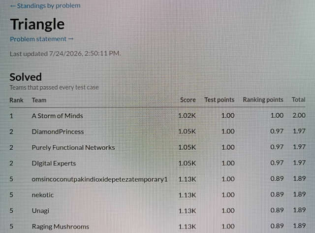

# icfpc2026

Team "A Storm of Minds" repo for the
[2026 edition of the ICFP Programming Contest](https://icfpcontest2026.com/).

We (Chris and Jan) like to meet in person for the contest, but that did not
work out this year. Also each of us has some non-contest activities during
the weekend, so we knew beforehand that this would be a part-time contest for us.

Being happier as coders than prompters, we did not use AI.

We liked the task description at first sight,
being reminded of the 2D language from 2006 “Cult of the Bound Variable”
and the 3D language from 2024. 
The tools provided by the organizers seemed very comprehensive, so we
did not even look at the practice problems but started right away
with the semester 1 problems.

## The problems

With one exception (History lesson) we wrote all out solution by hand
in the organizer's editor.

Problems are listed in the order in which we solved them.
The contest started at local time 14:00 (2PM). The "contest times"
given here are just offsets from the start, e.g. CT 01:02:00 would
be Saturday, 2PM in London, or 16:00 in our time zone.

### Triangular

Jan quickly had a solution, even getting us rank one about 45
minutes after the contest started:



We improved this later, but the best score that other teams got eluded us for
a long time. Only one hour before the end of the contest we found the
13-tick solution.

### Reverse

Written by Jan. Solution submitted at CT 00:02:58.

### Memory

Written by Chris.

Our (only) idea for this was to use a pipe as ring buffer.
Since a pipe can not connect to the box it comes from, an auxiliary
box is needed that acts as a transmitter. It took a few hours to get
familiar with the instructions and to fix the bugs. This was made
a bit harder by me not discovering the public test cases
feature in the editor until later in the contest (Some time after the lightning round, IIRC).

Submitted a working solution at CT 00:05:56.

### History

Chris wrote a small Lisp program to convert each letter into
```<ascii code`s`` and format those into a square box, reversing
each second line. Apart from being very large, that does not work
because the backticks match in vertical diretion, too, ans it is an error
if there's anything other than a space or digit between them.
So the code was changed to generate the codes using arithmetic instead,
starting from the code of the last letter. This yielded a working
solution at CT 00:07:57.

This was later improved by also keeping track of the off-hand value and
deriving shorter instructions sequences.

Still later we used the same approach to not generate the characters themselves,
but an index into a table of the characters by descending frequency. I.e.,
space is most common, so it gets code 0, next is 'a', then 'e', and so on.
So our final solution had three boxes: one to generate the code sequence,
one that translates codes into actual ASCII codes, and the controlling box.

That yielded a smaller solution, but still not very good. We played around with
the idea to come up with a linear congruential rng that would yielded the character
sequence with the right seed, but lacking experience in that field, we did not
follow it through, and don't even know if it's realistic. We also looked at huffman coding,
but found it too complex to code in the Littleman language.

### Sort

Written by Jan. Solution submitted at CT 00:11:09.

### Brackets

After thinking for some time about building a stack using
the general purpose memory, we noticed the input length limit,
and it occurred to us that the three bracket types + a value for no bracket
could be encoded in two bits, so 32 values fit into a 64-bit integer,
so push and pop are just left and right shifts.

To translate from ASCII to 1,2,3, we put the code in the backpack, and
use `x` and `]` to identify the three possible codes.

And after fixing some edge cases, we submitted
our solution at CT 00:17:05.

### Packets

We solved this in a rather straightforward way, storing packets
in memory using their sequence number as address, and then checking
what we can output. Submitted at CT 00:22:59.

### Plotter

We thought this to be to hard to start, until we discovered that we had forgotten
about the cursor positioning via the top pipe. Once we rediscovered that
feature of the display, coding bresenham and sending the pixels to the display
was relatively straightforward. Submitted at CT 01:07:46.

### And the rest ...

We did not solve any of the other problems. At the time the scoreboard
was frozen, we were right in the middle, around rank 90.

We wrote a [strategy outline](strategy.md) for the problems we did not solve,
but did not get to work in that direction due to the real world intervening.

A small component library is in the [components](components/) folder.

## Final thoughts

We very much enjoyed the contest despite not being able to work at it
full time.

The organizers provided a very interesting task with very few clarifications
of fixes needed, and the tools they provided were extremely good, and were even
enhanced with more features during the contest. This was very helpful
and meant that we could start with the task right away, instead of having
to spend time on tooling.

A big **Thank you!** to the organizers.